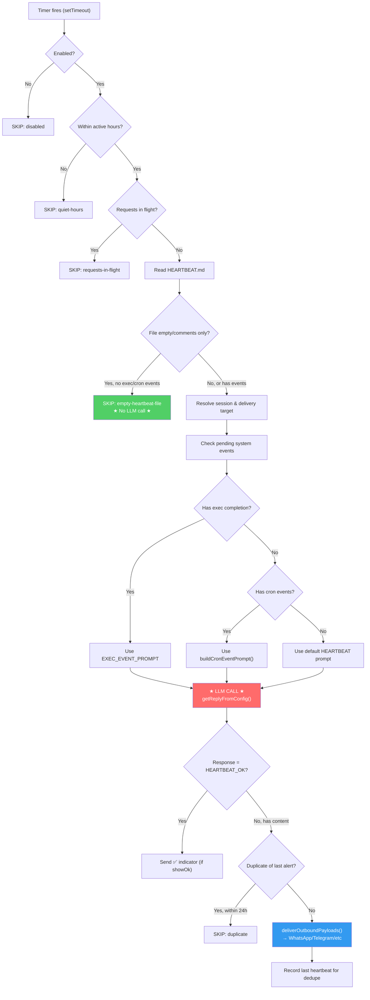
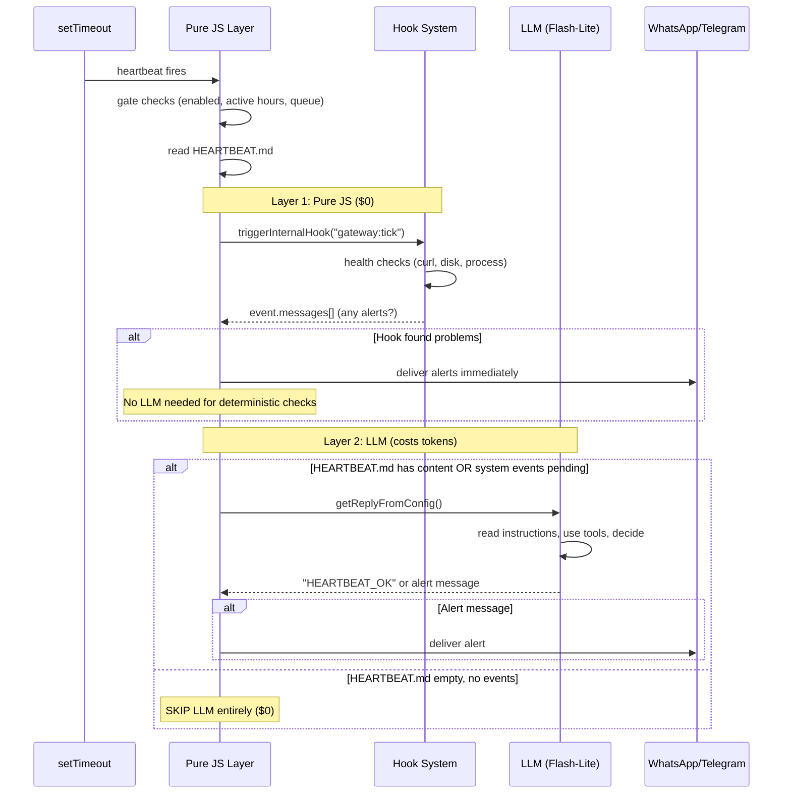

# LLM Model Assessment for Heartbeats, Health Checks & Automation

> **Purpose**: Unbiased comparison of all major LLM providers for OpenClaw's heartbeat and automation tasks.
> **Date**: February 2026
> **Source**: Verified from official pricing pages (ai.google.dev, openai.com, x.ai, deepseek.com, docs.anthropic.com)

---

## What the Heartbeat LLM Actually Does

From [`heartbeat-runner.ts:377-767`](file:///Users/jerrisontiong/aurochs-clean/src/infra/heartbeat-runner.ts#L377-L767):

```
Timer fires → Read HEARTBEAT.md → LLM decides → "HEARTBEAT_OK" or alert message
```

**Default prompt** (from [`auto-reply/heartbeat.ts`](file:///Users/jerrisontiong/aurochs-clean/src/auto-reply/heartbeat.ts)):

```
"Read HEARTBEAT.md if it exists. Follow it strictly. Do not infer or repeat
old tasks from prior chats. If nothing needs attention, reply HEARTBEAT_OK."
```

### Three Scenarios by Difficulty

| Scenario             | What the LLM Does                                   | Tokens            | Difficulty                |
| -------------------- | --------------------------------------------------- | ----------------- | ------------------------- |
| **Normal heartbeat** | Read HEARTBEAT.md → decide OK or alert              | ~500 in, ~50 out  | Easy                      |
| **Exec completion**  | Read command stdout/stderr → summarize for user     | ~500 in, ~200 out | Medium                    |
| **Cron event**       | Process cron payload → use tools → compose response | ~800 in, ~300 out | Hard (needs tool calling) |

### Model Requirements

1. ✅ **Instruction following** — must follow "reply HEARTBEAT_OK" strictly
2. ✅ **Tool calling** — for exec/cron events that need file reads or web fetches
3. ✅ **Reading comprehension** — summarize build logs, parse cron payloads
4. ❌ **NOT needed**: creative writing, image generation, long-form reasoning

---

## Heartbeat Architecture — How It's Wired

### File Map

| File                                                                                                         | Purpose                                                                                       | Lines |
| ------------------------------------------------------------------------------------------------------------ | --------------------------------------------------------------------------------------------- | ----- |
| [heartbeat-runner.ts](file:///Users/jerrisontiong/aurochs-clean/src/infra/heartbeat-runner.ts)               | **Main entry point.** `runHeartbeatOnce()` (L377-767) and `startHeartbeatRunner()` (L769-964) | 965   |
| [heartbeat.ts](file:///Users/jerrisontiong/aurochs-clean/src/auto-reply/heartbeat.ts)                        | Default prompt, `HEARTBEAT_OK` token stripping, empty-file detection                          | 172   |
| [heartbeat-active-hours.ts](file:///Users/jerrisontiong/aurochs-clean/src/infra/heartbeat-active-hours.ts)   | `isWithinActiveHours()` — quiet hours logic                                                   | —     |
| [heartbeat-events.ts](file:///Users/jerrisontiong/aurochs-clean/src/infra/heartbeat-events.ts)               | Event emitter for heartbeat status (`sent`, `ok-empty`, `ok-token`, `skipped`, `failed`)      | 59    |
| [heartbeat-visibility.ts](file:///Users/jerrisontiong/aurochs-clean/src/infra/heartbeat-visibility.ts)       | Controls whether to show OK/alert messages per channel                                        | —     |
| [heartbeat-wake.ts](file:///Users/jerrisontiong/aurochs-clean/src/infra/heartbeat-wake.ts)                   | External wake triggers (hooks can wake the heartbeat)                                         | —     |
| [heartbeat-events-filter.ts](file:///Users/jerrisontiong/aurochs-clean/src/infra/heartbeat-events-filter.ts) | Filters pending system events for heartbeat processing                                        | —     |
| [outbound/deliver.ts](file:///Users/jerrisontiong/aurochs-clean/src/infra/outbound/deliver.ts)               | `deliverOutboundPayloads()` — sends alerts to WhatsApp/Telegram/etc                           | —     |
| [outbound/targets.ts](file:///Users/jerrisontiong/aurochs-clean/src/infra/outbound/targets.ts)               | `resolveHeartbeatDeliveryTarget()` — determines where to send alerts                          | —     |
| [system-events.ts](file:///Users/jerrisontiong/aurochs-clean/src/infra/system-events.ts)                     | `peekSystemEventEntries()` — checks for pending exec/cron events                              | —     |
| [internal-hooks.ts](file:///Users/jerrisontiong/aurochs-clean/src/hooks/internal-hooks.ts)                   | Hook system — supports `"gateway"` event type, `gateway:tick` possible                        | 182   |

### Execution Flow — `runHeartbeatOnce()`



### Scheduler — `startHeartbeatRunner()`

The scheduler at L769-964 maintains a per-agent timer loop:

```typescript
// Simplified from startHeartbeatRunner()
function scheduleNext() {
  const now = Date.now();
  // Find the agent with the earliest nextDueMs
  const nextAgent = agentStates.sort((a, b) => a.nextDueMs - b.nextDueMs)[0];
  const delay = Math.max(0, nextAgent.nextDueMs - now);

  timer = setTimeout(async () => {
    await runOnce({ cfg, agentId: nextAgent.agentId, heartbeat: nextAgent.heartbeat });
    advanceAgentSchedule(nextAgent, Date.now()); // nextDueMs += intervalMs
    scheduleNext(); // re-arm for next agent
  }, delay);
}
```

**Key architecture details**:

- Uses **in-memory `setTimeout`** — dies with the process
- Supports **multiple agents** — each agent can have different heartbeat intervals
- Supports **per-agent model override** via `heartbeat.model`
- Timer is re-armed after each run (not `setInterval`)
- `updateConfig()` at L830-875 handles hot-reload when config changes

### What JS Does vs What the LLM Does

```
┌─────────────────────────────────────────────────────────────┐
│                    HEARTBEAT PIPELINE                        │
├─────────────────────────────────────────────────────────────┤
│                                                              │
│  PURE JS (no LLM, no cost, deterministic):                  │
│  ├── Timer scheduling (setTimeout)                           │
│  ├── Active hours check                                      │
│  ├── Queue check (skip if requests in flight)                │
│  ├── Read HEARTBEAT.md from disk                             │
│  ├── Empty file detection (skip = no LLM call)               │
│  ├── System event collection (exec/cron payloads)            │
│  ├── Delivery target resolution                              │
│  ├── HEARTBEAT_OK token stripping from response              │
│  ├── Duplicate detection (same alert within 24h)             │
│  └── Outbound delivery (WhatsApp/Telegram/etc)               │
│                                                              │
│  ═══════════════════════════════════════════                  │
│                                                              │
│  LLM (costs tokens, non-deterministic):                      │
│  ├── Read HEARTBEAT.md content + interpret instructions       │
│  ├── Process exec completion output → summarize               │
│  ├── Process cron event payloads → decide action              │
│  ├── Use tools (read_file, web_fetch) for context             │
│  ├── Decide: alert or HEARTBEAT_OK                            │
│  └── Compose human-readable alert message                     │
│                                                              │
└─────────────────────────────────────────────────────────────┘
```

### The Hook System — Where Pure-JS Health Checks Can Go

OpenClaw has an internal hook system at [internal-hooks.ts](file:///Users/jerrisontiong/aurochs-clean/src/hooks/internal-hooks.ts):

```typescript
// Supported event types (L11)
type InternalHookEventType = "command" | "session" | "agent" | "gateway";

// Register a handler
registerInternalHook("gateway:tick", async (event) => {
  // Pure JS health check — no LLM
  const response = await fetch("http://localhost:8080/health");
  if (!response.ok) {
    event.messages.push("⚠️ API health check failed!");
  }
});

// Trigger it (would add to heartbeat-runner.ts BEFORE the LLM call)
await triggerInternalHook(
  createInternalHookEvent("gateway", "tick", sessionKey, {
    cfg,
    agentId,
    nowMs: Date.now(),
  }),
);
```

**Current state**: The `"gateway"` event type exists but **no `"tick"` action is wired yet**. This is the insertion point for pure-JS health checks — ~5 lines added to `runHeartbeatOnce()` before the `getReplyFromConfig()` call.

### Two-Layer Architecture (Proposed)



This means:

- **Health checks** (is port up? is disk full?) → Pure JS hooks, $0, milliseconds
- **Judgment calls** (should I remind the user? what does the cron output mean?) → LLM, costs tokens, seconds
- **Empty heartbeat** (nothing to do) → Already skipped at L418-430, $0

### Config Schema for Heartbeats

```json5
// In openclaw.config.json5
{
  agents: {
    defaults: {
      heartbeat: {
        every: "30m", // interval (parsed by parseDurationMs)
        model: "google/gemini-2.5-flash-lite", // per-heartbeat model override
        prompt: "...", // custom heartbeat prompt
        target: "last", // "last" | "whatsapp" | "telegram" | etc
        activeHours: { start: "09:00", end: "22:00" },
        ackMaxChars: 300, // max chars for heartbeat acknowledgment
        includeReasoning: false, // include thinking in output
        accountId: "...", // explicit account for delivery
      },
    },
    // Per-agent overrides
    agents: {
      "ops-agent": {
        heartbeat: {
          every: "5m",
          model: "google/gemini-2.5-flash", // smarter model for ops
          target: "whatsapp",
          prompt: "Check system health and report issues",
        },
      },
    },
  },
}
```

### Heartbeat Event System

The heartbeat emits events via [heartbeat-events.ts](file:///Users/jerrisontiong/aurochs-clean/src/infra/heartbeat-events.ts) that can be monitored:

```typescript
type HeartbeatEventPayload = {
  ts: number;
  status: "sent" | "ok-empty" | "ok-token" | "skipped" | "failed";
  to?: string; // delivery target
  accountId?: string;
  preview?: string; // first 200 chars of message
  durationMs?: number;
  hasMedia?: boolean;
  reason?: string; // why skipped: "disabled" | "quiet-hours" | "empty-heartbeat-file" | "duplicate" | etc
  channel?: string; // "whatsapp" | "telegram" | etc
  silent?: boolean; // suppressed OK (showOk: false)
  indicatorType?: "ok" | "alert" | "error";
};

// Subscribe to events
onHeartbeatEvent((evt) => {
  console.log(`Heartbeat: ${evt.status} (${evt.durationMs}ms)`);
});
```

---

## Complete Provider Comparison

### Pricing Table (per 1M tokens, paid tier)

| Provider      | Model                 | Input  | Output | **Per Heartbeat**¹ | Tool Call    | Free Tier          |
| ------------- | --------------------- | ------ | ------ | ------------------ | ------------ | ------------------ |
| **Google**    | Gemini 2.0 Flash-Lite | $0.075 | $0.30  | **$0.000068**      | ✅ Good      | 1,500 RPD          |
| **Google**    | Gemini 2.5 Flash-Lite | $0.10  | $0.40  | **$0.000090**      | ✅ Good      | 1,500 RPD (50 RPM) |
| **Google**    | Gemini 2.0 Flash      | $0.10  | $0.40  | **$0.000090**      | ✅ Excellent | 1,500 RPD          |
| **OpenAI**    | GPT-4o mini           | $0.15  | $0.60  | **$0.000135**      | ✅ Excellent | —                  |
| **DeepSeek**  | V3.2 (deepseek-chat)  | $0.28  | $0.42  | **$0.000182**²     | ✅ Good      | —                  |
| **xAI**       | Grok 4.1 Fast         | $0.20  | $0.50  | **$0.000150**      | ✅ Good      | $25 credits        |
| **Google**    | Gemini 2.5 Flash      | $0.30  | $2.50  | **$0.000400**      | ✅ Excellent | 1,500 RPD          |
| **xAI**       | Grok 3 Mini           | $0.30  | $0.50  | **$0.000200**      | ✅ Good      | $25 credits        |
| **Google**    | Gemini 3 Flash        | $0.50  | $3.00  | **$0.000550**      | ✅ Excellent | 1,000 RPD          |
| **Anthropic** | Claude 3.5 Haiku      | $0.80  | $4.00  | **$0.000800**      | ✅ Excellent | —                  |
| **OpenAI**    | o4-mini               | $1.10  | $4.40  | **$0.000990**      | ✅ Excellent | —                  |
| **xAI**       | Grok 2                | $2.00  | $10.00 | **$0.002000**      | ✅ Good      | $25 credits        |
| **Local**     | Qwen3 8B (Ollama)     | $0     | $0     | **$0**             | ⚠️ BFCL 43.3 | N/A                |

> ¹ Per heartbeat = 500 input tokens + 100 output tokens (typical)
> ² DeepSeek adds $0.0004 per API call surcharge, making effective cost $0.000582

### Monthly Cost (48 heartbeats/day, 30 days)

| Model                 | Monthly   | Notes                                         |
| --------------------- | --------- | --------------------------------------------- |
| Qwen3 8B (Ollama)     | **$0.00** | CPU-only, ~8GB RAM, inconsistent tool calling |
| Gemini 2.0 Flash-Lite | **$0.10** | Cheapest API. Free tier covers it entirely    |
| Gemini 2.5 Flash-Lite | **$0.13** | Free tier covers it entirely                  |
| Gemini 2.0 Flash      | **$0.13** | Free tier covers it entirely                  |
| GPT-4o mini           | **$0.19** | No free tier, but very cheap                  |
| Grok 4.1 Fast         | **$0.22** | $25 signup credit = ~3 years of heartbeats    |
| DeepSeek V3.2         | **$0.84** | Per-call fee ($0.58/mo) dominates token cost  |
| Grok 3 Mini           | **$0.29** | Cheap output tokens                           |
| Gemini 2.5 Flash      | **$0.58** | Thinking budget control                       |
| Gemini 3 Flash        | **$0.79** | Overkill for heartbeats                       |
| Claude 3.5 Haiku      | **$1.15** | Best tool calling, but expensive              |
| o4-mini               | **$1.43** | Reasoning model, massive overkill             |

---

## Provider Deep Dives

### Google Gemini — Best for Heartbeats

**Why**: Free tier covers ALL heartbeat volume. No API key limits. Excellent tool calling across all Flash models.

| Model          | Best For                             | Thinking Budget  | Context |
| -------------- | ------------------------------------ | ---------------- | ------- |
| 2.0 Flash-Lite | Maximum cheapness, simple heartbeats | No               | 1M      |
| 2.5 Flash-Lite | High-volume pings, at-scale usage    | No               | 1M      |
| 2.0 Flash      | Balanced, built for agents           | No               | 1M      |
| 2.5 Flash      | Complex heartbeats needing reasoning | Yes (adjustable) | 1M      |
| 3 Flash        | Frontier intelligence, coding tasks  | Yes              | 1M      |

**Key advantage**: `text-embedding-004` is **free** — you can use Gemini for both heartbeats AND embeddings at $0/month.

**Free tier rate limits** (relevant for heartbeats):

- Flash-Lite models: 50 RPM, 1,500 RPD — 48 heartbeats/day uses 3% of daily quota
- Flash models: 10-15 RPM, 1,000-1,500 RPD — still well within limits

### OpenAI — Reliable But No Free Tier

| Model       | Input $/M | Output $/M | Tool Calling | Notes                     |
| ----------- | --------- | ---------- | ------------ | ------------------------- |
| GPT-4o mini | $0.15     | $0.60      | ✅ Excellent | Best value OpenAI model   |
| GPT-4o      | $2.50     | $10.00     | ✅ Excellent | Overkill                  |
| o4-mini     | $1.10     | $4.40      | ✅ Excellent | Reasoning model, overkill |

**Key advantage**: Rock-solid tool calling. GPT-4o mini has the most mature function-calling implementation.

**Key disadvantage**: No free tier. OpenAI charges from token #1. For heartbeats this is $0.19/month (negligible), but Google gives you the same for $0.

### xAI Grok — Surprisingly Competitive

| Model         | Input $/M | Output $/M | Tool Calling | Notes                 |
| ------------- | --------- | ---------- | ------------ | --------------------- |
| Grok 4.1 Fast | $0.20     | $0.50      | ✅ Good      | 2M context, very fast |
| Grok 3 Mini   | $0.30     | $0.50      | ✅ Good      | Budget option         |
| Grok 3        | $3.00     | $15.00     | ✅ Good      | Premium, overkill     |

**Key advantage**: $25 free credits on signup. Grok 4.1 Fast has a massive 2M context window.

**Key disadvantage**: Less mature tool-calling ecosystem compared to OpenAI/Google. Web search and X search tools cost extra ($2.50-$5.00 per 1,000 calls).

### DeepSeek — Cheap Tokens, Expensive Calls

| Model                | Input $/M | Output $/M | +Per Call | Effective Heartbeat Cost |
| -------------------- | --------- | ---------- | --------- | ------------------------ |
| V3.2 (deepseek-chat) | $0.28     | $0.42      | +$0.0004  | $0.000582                |
| V3.2 (cached input)  | $0.028    | $0.42      | +$0.0004  | —                        |

**Key advantage**: Cheapest output tokens in the market ($0.42/M). "Thinking with tools" capability. Cache hits are 10x cheaper.

**Key disadvantage**: The **$0.0004 per API call** surcharge destroys its cost advantage for frequent, small calls like heartbeats. For a 600-token heartbeat, the surcharge is **70% of the total cost**. DeepSeek is better for long conversations and batch jobs, not ping-like heartbeats.

### Anthropic Claude — Premium Quality

| Model            | Input $/M | Output $/M | Tool Calling | Notes                      |
| ---------------- | --------- | ---------- | ------------ | -------------------------- |
| Claude 3.5 Haiku | $0.80     | $4.00      | ✅ Excellent | Best instruction following |
| Claude 4 Sonnet  | $3.00     | $15.00     | ✅ Excellent | Main chat model            |

**Key advantage**: The best instruction following and tool calling in the industry. Claude will NEVER fumble a "reply HEARTBEAT_OK" instruction.

**Key disadvantage**: Most expensive option. No free tier. For heartbeats, you're paying 10x more than Gemini Flash-Lite for marginal quality gains.

### Local (Ollama) — Truly Free

| Model        | RAM  | Tool Calling | Speed     | Notes                                         |
| ------------ | ---- | ------------ | --------- | --------------------------------------------- |
| Qwen3 8B     | ~8GB | ⚠️ BFCL 43.3 | 100-500ms | Best local tool calling per community reports |
| Gemma 3 4B   | ~4GB | ❌ Poor      | 200-400ms | Not recommended for tool calling              |
| Llama 3.3 8B | ~8GB | ⚠️ Moderate  | 150-400ms | Decent but less tested                        |

**Key advantage**: $0 forever. No API dependency. Works offline.

**Key disadvantage**: Tool calling is inconsistent. The heartbeat LLM runs in a full agent session with tool access — a model that fumbles tool-call formatting will cause heartbeat failures. Qwen3 8B users report it "works like a charm for tool calling" but the BFCL benchmark score (43.3) is significantly below API models.

---

## Recommendations

### For Heartbeats (48/day, every 30min during active hours)

| Priority            | Model                 | Cost/mo        | Why                                                       |
| ------------------- | --------------------- | -------------- | --------------------------------------------------------- |
| **🥇 Best overall** | Gemini 2.5 Flash-Lite | $0 (free tier) | Cheapest API, excellent tool calling, highest rate limits |
| **🥈 Runner-up**    | GPT-4o mini           | $0.19          | Most mature tool calling, rock-solid                      |
| **🥉 Budget API**   | Grok 4.1 Fast         | $0.22          | $25 free credits, 2M context                              |
| **💰 Free local**   | Qwen3 8B (Ollama)     | $0             | Only if fully offline is required                         |

### For Cron Jobs (longer prompts, less frequent)

| Priority           | Model            | Why                                                       |
| ------------------ | ---------------- | --------------------------------------------------------- |
| **🥇 Best value**  | DeepSeek V3.2    | Per-call fee amortized over more tokens. Cheapest output. |
| **🥈 Quality**     | Gemini 2.5 Flash | Thinking budget control, 1M context                       |
| **🥉 Reliability** | GPT-4o mini      | Mature, well-tested                                       |

### For Main Chat (full quality, user-facing)

| Priority            | Model                  | Why                                           |
| ------------------- | ---------------------- | --------------------------------------------- |
| **🥇 Best quality** | Claude 4 Sonnet / Opus | Best instruction following, nuanced reasoning |
| **🥈 Alternative**  | Gemini 3 Flash         | 78% SWE-bench, excellent coding               |
| **🥉 Budget**       | Gemini 2.5 Flash       | Thinking budget, 1M context                   |

---

## Tiered Strategy for Aurochs

```
┌─────────────────────────────────────────────────────────┐
│                    LLM TIER MAP                          │
├───────────┬─────────────────────┬────────────┬──────────┤
│ Task      │ Model               │ Cost/call  │ Monthly  │
├───────────┼─────────────────────┼────────────┼──────────┤
│ Health    │ Pure JS hooks       │ $0         │ $0       │
│ checks   │ (no LLM)            │            │          │
├───────────┼─────────────────────┼────────────┼──────────┤
│ Heartbeat │ Gemini 2.5          │ $0.000090  │ $0 free  │
│           │ Flash-Lite          │            │ tier     │
├───────────┼─────────────────────┼────────────┼──────────┤
│ Cron jobs │ DeepSeek V3.2 or    │ $0.0005-   │ $0.50-   │
│           │ Gemini 2.5 Flash    │ $0.002     │ $2.00    │
├───────────┼─────────────────────┼────────────┼──────────┤
│ Main chat │ Claude Opus or      │ $0.01-0.10 │ varies   │
│           │ Gemini 3 Flash      │            │          │
└───────────┴─────────────────────┴────────────┴──────────┘

Total automation cost: ~$0.50-2.50/month
(vs current: all tasks on Claude Opus = $20-50+/month)
```

---

## OpenClaw Configuration

To set the heartbeat model in OpenClaw config:

```json5
// openclaw.config.json5
{
  agents: {
    defaults: {
      heartbeat: {
        // Model override for heartbeat only
        model: "google/gemini-2.5-flash-lite",
        every: "30m",
        activeHours: { start: "09:00", end: "22:00" },
      },
    },
  },
}
```

The `heartbeat.model` field is read at [`heartbeat-runner.ts:542`](file:///Users/jerrisontiong/aurochs-clean/src/infra/heartbeat-runner.ts#L542):

```typescript
const heartbeatModelOverride = heartbeat?.model?.trim() || undefined;
const replyOpts = heartbeatModelOverride
  ? { isHeartbeat: true, heartbeatModelOverride }
  : { isHeartbeat: true };
const replyResult = await getReplyFromConfig(ctx, replyOpts, cfg);
```

This means the heartbeat uses a **separate model** from the main chat — you can run Opus for conversations and Flash-Lite for heartbeats with no code changes.

---

## Embedding Provider Costs (Bonus)

For memory search embeddings (separate from LLM heartbeats):

| Provider   | Model                   | Cost/M tokens | Monthly (65 calls/day) | Notes              |
| ---------- | ----------------------- | ------------- | ---------------------- | ------------------ |
| **Google** | text-embedding-004      | **Free**      | **$0**                 | Official free tier |
| **OpenAI** | text-embedding-3-small  | $0.02         | $0.008                 | Cheapest paid      |
| **Voyage** | voyage-3                | $0.06         | $0.024                 | Best quality       |
| **Local**  | embeddinggemma-300m-qat | $0            | $0                     | ~350MB RAM, CPU    |

**Recommendation**: Use `google/text-embedding-004` for embeddings. It's free and already implemented.
