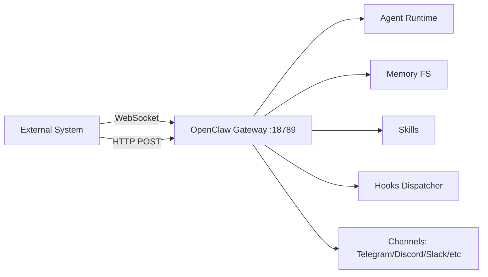

# OpenClaw Wiring Guide — How to Connect to a Clean Instance

> **Purpose**: This document is the canonical reference for how an external system (Aurochs MSC, a provisioning API, a dashboard, or any integration) connects to a clean OpenClaw instance. Every integration surface is documented here.
> **Updated**: v2026.2.26

---

## 1. Architecture Overview

OpenClaw is a **single-process Node.js gateway** that:

- Listens on a single port (default `18789`)
- Exposes both **WebSocket** (primary) and **HTTP** endpoints on that port
- All state lives on the filesystem under `~/.openclaw/`
- Config is a single JSON file: `~/.openclaw/openclaw.json`



---

## 2. WebSocket Protocol (Primary API)

### 2.1 Connection Flow

```text
Client                          Gateway
  |---- ws://host:18789 -------->|
  |                               |  (HTTP Upgrade)
  |<--- WebSocket Connected ------|
  |                               |
  |---- { method: "connect",  -->|  (First frame MUST be "connect")
  |       params: ConnectParams } |
  |                               |
  |<--- { result: HelloOk }  ----|  (Server responds with HelloOk)
  |                               |
  |---- { method: "send", ... }->|  (Normal request/response)
  |<--- { result: ... }     ----|
  |                               |
  |<--- { event: "agent", ... }--|  (Server pushes events)
  |<--- { event: "chat", ... }  |
```

### 2.2 ConnectParams (Authentication)

```typescript
interface ConnectParams {
  minProtocol: number; // Use PROTOCOL_VERSION (current: check code)
  maxProtocol: number; // Same
  client: {
    id: string; // e.g. "aurochs-api"
    displayName?: string;
    version: string; // e.g. "1.0.0"
    platform: string; // e.g. "linux"
    mode: string; // "backend" | "webchat" | "node" | "probe"
    instanceId?: string; // Unique instance identifier
  };
  caps: string[]; // Capabilities array
  auth?: {
    token?: string; // Matches OPENCLAW_GATEWAY_TOKEN
    password?: string; // Alternative: password auth
  };
  role?: string; // "operator" (default)
  scopes?: string[]; // ["operator.admin"] (default)
}
```

### 2.3 Frame Format

All frames are JSON over WebSocket:

**Request** (client → server):

```json
{ "id": "uuid", "method": "send", "params": { "message": "hello" } }
```

**Response** (server → client):

```json
{ "id": "uuid", "result": { ... } }
```

**Event** (server → client, unsolicited):

```json
{ "event": "agent", "data": { ... }, "seq": 42 }
```

### 2.4 All WebSocket Methods (94 total)

| Category           | Methods                                                                                                                                                                                            |
| ------------------ | -------------------------------------------------------------------------------------------------------------------------------------------------------------------------------------------------- |
| **Core Chat**      | `send`, `agent`, `agent.wait`, `agent.identity.get`, `chat.send`, `chat.history`, `chat.abort`                                                                                                     |
| **Health**         | `health`, `status`, `logs.tail`                                                                                                                                                                    |
| **Config**         | `config.get`, `config.set`, `config.apply`, `config.patch`, `config.schema`                                                                                                                        |
| **Sessions**       | `sessions.list`, `sessions.preview`, `sessions.patch`, `sessions.reset`, `sessions.delete`, `sessions.compact`                                                                                     |
| **Models**         | `models.list`                                                                                                                                                                                      |
| **Agents**         | `agents.list`, `agents.create`, `agents.update`, `agents.delete`, `agents.files.list`, `agents.files.get`, `agents.files.set`                                                                      |
| **Skills**         | `skills.status`, `skills.bins`, `skills.install`, `skills.update`                                                                                                                                  |
| **Cron**           | `cron.list`, `cron.status`, `cron.add`, `cron.update`, `cron.remove`, `cron.run`, `cron.runs`                                                                                                      |
| **Exec Approvals** | `exec.approvals.get`, `exec.approvals.set`, `exec.approvals.node.get`, `exec.approvals.node.set`, `exec.approval.request`, `exec.approval.waitDecision`, `exec.approval.resolve`                   |
| **Channels**       | `channels.status`, `channels.logout`                                                                                                                                                               |
| **TTS**            | `tts.status`, `tts.providers`, `tts.enable`, `tts.disable`, `tts.convert`, `tts.setProvider`                                                                                                       |
| **Usage**          | `usage.status`, `usage.cost`                                                                                                                                                                       |
| **Heartbeat**      | `last-heartbeat`, `set-heartbeats`, `wake`                                                                                                                                                         |
| **Nodes**          | `node.pair.request`, `node.pair.list`, `node.pair.approve`, `node.pair.reject`, `node.pair.verify`, `node.rename`, `node.list`, `node.describe`, `node.invoke`, `node.invoke.result`, `node.event` |
| **Devices**        | `device.pair.list`, `device.pair.approve`, `device.pair.reject`, `device.pair.remove`, `device.token.rotate`, `device.token.revoke`                                                                |
| **Wizard**         | `wizard.start`, `wizard.next`, `wizard.cancel`, `wizard.status`                                                                                                                                    |
| **System**         | `system-presence`, `system-event`, `browser.request`, `talk.config`, `talk.mode`, `update.run`, `voicewake.get`, `voicewake.set`                                                                   |

### 2.5 All WebSocket Events (22 total)

| Event                     | Description                        |
| ------------------------- | ---------------------------------- |
| `connect.challenge`       | Auth challenge during connection   |
| `agent`                   | Agent response text/status updates |
| `chat`                    | WebChat message events             |
| `presence`                | Client presence changes            |
| `tick`                    | Periodic keepalive (default 30s)   |
| `talk.mode`               | Voice talk mode changes            |
| `shutdown`                | Gateway shutting down              |
| `health`                  | Health status changes              |
| `heartbeat`               | Heartbeat results                  |
| `cron`                    | Cron job execution events          |
| `node.pair.requested`     | Node pairing request               |
| `node.pair.resolved`      | Node pairing resolved              |
| `node.invoke.request`     | Node tool invocation request       |
| `device.pair.requested`   | Device pairing request             |
| `device.pair.resolved`    | Device pairing resolved            |
| `voicewake.changed`       | Voice wake word changes            |
| `exec.approval.requested` | Tool execution needs approval      |
| `exec.approval.resolved`  | Approval decision made             |
| `update.available`        | Software update available          |

---

## 3. HTTP API Endpoints

All on the same port as WebSocket (`18789`).

### 3.1 Hooks API — Send Messages Programmatically

The **primary way** for an external system to inject messages into OpenClaw.

**Auth**: `Authorization: Bearer <hooks_token>` or `X-OpenClaw-Token: <hooks_token>`
The hooks token is set in `openclaw.json` → `hooks.token`.

#### POST `/hooks/wake` — Wake the agent

```bash
curl -X POST http://localhost:18789/hooks/wake \
  -H "Authorization: Bearer $HOOKS_TOKEN" \
  -H "Content-Type: application/json" \
  -d '{"text": "Check your emails", "mode": "now"}'
```

Response: `{"ok": true, "mode": "now"}`

`mode`: `"now"` (immediate) or `"next-heartbeat"` (deferred)

#### POST `/hooks/agent` — Send a message as a named user

```bash
curl -X POST http://localhost:18789/hooks/agent \
  -H "Authorization: Bearer $HOOKS_TOKEN" \
  -H "Content-Type: application/json" \
  -d '{
    "message": "Please generate the monthly report",
    "name": "Provisioning API",
    "channel": "hook",
    "deliver": true,
    "wakeMode": "now"
  }'
```

Response: `{"ok": true, "runId": "uuid"}`

**Full payload fields:**

```typescript
{
  message: string;          // The message text
  name: string;             // Sender display name
  agentId?: string;         // Target agent (multi-agent)
  wakeMode: "now" | "next-heartbeat";
  sessionKey?: string;      // Target specific session
  deliver: boolean;         // true = deliver response back
  channel: "hook" | "telegram" | "discord" | ...;
  to?: string;              // Delivery target
  model?: string;           // Override model for this run
  thinking?: string;        // Thinking mode
  timeoutSeconds?: number;  // Run timeout
}
```

#### Hook Mappings — Custom webhook endpoints

Configure in `openclaw.json` → `hooks.mappings[]` to create custom endpoints that transform incoming webhooks into agent messages. E.g., map GitHub webhooks, Stripe events, etc.

### 3.2 OpenAI Chat Completions API

**Endpoint**: `POST /v1/chat/completions`
**Auth**: Bearer token (same as gateway token)

Drop-in OpenAI-compatible endpoint. Supports streaming (`stream: true`).

```bash
curl http://localhost:18789/v1/chat/completions \
  -H "Authorization: Bearer $GATEWAY_TOKEN" \
  -H "Content-Type: application/json" \
  -d '{
    "model": "default",
    "messages": [{"role": "user", "content": "Hello"}],
    "stream": true
  }'
```

### 3.3 OpenResponses API

**Endpoint**: `POST /v1/responses`
**Auth**: Bearer token (same as gateway token)

OpenAI Responses API compatible endpoint.

### 3.4 Tools Invoke HTTP

**Endpoint**: `POST /v1/tools/invoke`
**Auth**: Bearer token

Programmatic tool invocation.

### 3.5 Control UI

**Endpoint**: `GET /` (when `controlUi.enabled: true`)

Built-in web dashboard for monitoring and configuration.

---

## 4. Config System (`openclaw.json`)

### 4.1 File Location

- Default: `~/.openclaw/openclaw.json`
- Override: `OPENCLAW_CONFIG_PATH` env var
- Legacy names also checked: `clawdbot.json`, `moldbot.json`, `moltbot.json`

### 4.2 Env Var Substitution

All `"${ENV_VAR}"` patterns in the JSON are resolved at load time:

```json
{
  "gateway": {
    "auth": { "token": "${OPENCLAW_GATEWAY_TOKEN}" }
  }
}
```

### 4.3 Secret References (NEW in v2026.2.26)

Instead of raw env vars, you can use structured `SecretRef` objects for sensitive values:

```json5
{
  models: {
    providers: {
      openai: {
        // Old way: "${OPENAI_API_KEY}"
        // New way:
        apiKey: { source: "env", provider: "default", id: "OPENAI_API_KEY" },
        // Or from a secrets file:
        apiKey: { source: "file", provider: "default", id: "/providers/openai/apiKey" },
        // Or from an external exec (Vault, 1Password, etc.):
        apiKey: { source: "exec", provider: "default", id: "vault/openai/api-key" },
      },
    },
  },
}
```

| Source | What it does                                                |
| ------ | ----------------------------------------------------------- |
| `env`  | Read from environment variable (same as `${VAR}` but typed) |
| `file` | Read from a secrets JSON file on disk (JSON pointer path)   |
| `exec` | Execute a command to retrieve the secret (e.g., Vault CLI)  |

The `${VAR}` env var substitution still works. SecretRef is opt-in for richer secret management.

### 4.3 Key Config Sections

```typescript
{
  agents: {
    defaults: {
      model: { primary: string, fallbacks: string[] },
      models: Record<string, { alias: string }>,
      heartbeat: { every: string, model: string, target: string },
      memorySearch: { enabled: boolean, provider: string, ... },
      compaction: { mode: string, ... },
      workspace: string,
      userTimezone: string,
    }
  },
  models: {
    mode: "merge" | "replace",
    providers: Record<string, {
      baseUrl: string,
      apiKey: string,
      api: string,
      models: { id: string, name: string }[]
    }>
  },
  gateway: {
    mode: "local",             // REQUIRED for startup
    bind: "loopback" | "lan",  // Named modes only
    auth: { mode: "token", token: string },
    trustedProxies: string[],
    controlUi: { enabled: boolean },
    port: number,              // Default 18789
  },
  hooks: {
    token: string,             // Auth for /hooks/* endpoints
    basePath: string,          // Default "/hooks"
    mappings: HookMapping[],
    internal: {
      enabled: boolean,
      entries: Record<string, { enabled: boolean }>
    }
  },
  skills: {
    install: { nodeManager: "npm" },
    load: { watch: boolean }
  },
  channels: {
    telegram: { enabled: boolean },
    discord: { enabled: boolean },
    // etc.
  },
  session: {
    reset: { mode: "idle", idleMinutes: number }
  },
  tools: {
    web: { search: { enabled: boolean, apiKey: string } }
  },
  ui: {
    assistant: { name: string, avatar: string }
  },
  cron: { enabled: boolean }
}
```

> [!IMPORTANT]
> **v2026.2.26 config validation**: `dmPolicy: "allowlist"` now requires `allowFrom` to contain at least one entry. Empty `allowFrom` with `allowlist` policy is a startup validation error. This affects all channel types.

<!-- separate alerts -->

> [!WARNING]
> **v2026.2.26 streaming migration**: `streamMode` is auto-migrated to `streaming` at config load. The new `streaming` key supports values: `off`, `partial`, `block`, `progress`.

### 4.4 Runtime Config Changes (via WebSocket)

```json
// Read
{ "method": "config.get", "params": { "key": "agents.defaults.model" } }

// Write single key
{ "method": "config.set", "params": { "key": "...", "value": "..." } }

// Patch multiple keys
{ "method": "config.patch", "params": { "patch": { "agents.defaults.model.primary": "..." } } }

// Apply full config object
{ "method": "config.apply", "params": { "config": { ... } } }
```

---

## 5. Internal Hooks System

Internal hooks are **in-process** event handlers that run inside OpenClaw.

### 5.1 Event Types

| Type      | Actions                     | Description           |
| --------- | --------------------------- | --------------------- |
| `command` | `new`, `reset`, `stop`, ... | Slash command events  |
| `session` | (various)                   | Session lifecycle     |
| `agent`   | `bootstrap`                 | Agent workspace setup |
| `gateway` | `startup`                   | Gateway boot          |
| `message` | `received`, `sent`          | Message in/out events |

### 5.2 Bundled Internal Hooks

Located at `src/hooks/bundled/`:

- **boot-md** → runs on `gateway:startup` — bootstraps workspace files (BOOT.md)
- **command-logger** → runs on `command` — logs command activity
- **session-memory** → runs on `command:new` — persists session to memory files
- **bootstrap-extra-files** → runs on `agent:bootstrap` — extra workspace file setup

### 5.3 External Hooks (JS/TS files)

Configure via `hooks.paths` in config. OpenClaw loads `.js`/`.ts` files from these paths at startup. Each file exports a `hook` function:

```typescript
// my-hook.js
export default {
  event: "command:new",
  handler: async (event) => {
    // event.type, event.action, event.sessionKey, event.context
  },
};
```

---

## 6. Filesystem Layout

```text
~/.openclaw/                     # State directory
├── openclaw.json                # Main config (REQUIRED)
├── workspace/                   # Agent workspace
│   ├── SOUL.md                  # Agent personality/instructions
│   ├── BOOT.md                  # Bootstrap instructions
│   ├── MEMORY.md                # Persistent memory (auto-injected)
│   └── memory/                  # Daily memory files
│       └── YYYY-MM-DD.md
├── data/                        # Persistent data
├── sessions/                    # Session state
├── logs/                        # Runtime logs
├── skills/                      # Installed skills
└── credentials/                 # OAuth tokens
```

### 6.1 Memory System

- **MEMORY.md** lives at workspace root, auto-injected into system prompt
- **memory/YYYY-MM-DD.md** — daily memory files, vector-indexed for search
- Memory search uses embedding providers (Gemini, OpenAI, Voyage, or local)
- Hybrid search: BM25 text + vector similarity (configurable weights)
- Session memory: tracks conversation context per session

---

## 7. Docker Wiring (Aurochs Pattern)

### 7.1 Volume Mounts

```yaml
volumes:
  # Config directory → maps to ~/.openclaw/
  - ./tenants/${TENANT}/config:/home/node/.openclaw:rw

  # Workspace → writable agent workspace
  - ./tenants/${TENANT}/workspace:/home/node/.openclaw/workspace:rw

  # Config file → the required openclaw.json
  - ./config/openclaw.default.json:/home/node/.openclaw/openclaw.default.json:ro

  # Skills → read-only skill bundles
  - ./skills:/home/node/.openclaw/skills:ro

  # SOUL.md → agent identity
  - ./identity/SOUL.md:/home/node/.openclaw/workspace/SOUL.md:ro
```

> **Critical**: The config MUST exist as `openclaw.json` (not `openclaw.default.json`) inside the mapped `~/.openclaw/` directory. As of v2026.2.20, OpenClaw validates config filename strictly.

### 7.2 Environment Variables

```bash
# Required
OPENCLAW_GATEWAY_TOKEN=<shared-secret>    # Gateway auth token

# LLM Provider Keys (referenced via ${} in config)
GEMINI_API_KEY=<key>
MOONSHOT_API_KEY=<key>
VENICE_API_KEY=<key>

# Optional
BRAVE_API_KEY=<key>                       # Web search
OPENCLAW_HOME=/home/node                  # Home directory override
OPENCLAW_STATE_DIR=/home/node/.openclaw   # State dir override
OPENCLAW_CONFIG_PATH=<path>              # Config file override
```

### 7.3 Connecting from the Provisioning API

The provisioning API (Aurochs API container) connects to OpenClaw containers via:

1. **HTTP Hooks** — Primary integration point for sending messages:

   ```text
   POST http://openclaw-${TENANT}:18789/hooks/agent
   ```

2. **WebSocket** — For real-time monitoring/control:

   ```text
   ws://openclaw-${TENANT}:18789
   ```

3. **Docker Proxy** — For container management (start/stop/restart):

   ```text
   tcp://docker-proxy:2375
   ```

---

## 8. Key Integration Patterns

### 8.1 Sending a Message (simplest)

```bash
# Via hooks (fire-and-forget, returns runId)
POST /hooks/agent
{ "message": "...", "name": "System", "channel": "hook", "deliver": true }
```

### 8.2 Sending and Waiting for Response

```typescript
// 1. Connect via WebSocket
const ws = new WebSocket("ws://localhost:18789");

// 2. Authenticate
ws.send(
  JSON.stringify({
    id: uuid(),
    method: "connect",
    params: {
      minProtocol: 1,
      maxProtocol: 1,
      client: { id: "aurochs", version: "1.0", platform: "linux", mode: "backend" },
      auth: { token: process.env.OPENCLAW_GATEWAY_TOKEN },
      caps: [],
    },
  }),
);

// 3. Send message
ws.send(
  JSON.stringify({
    id: uuid(),
    method: "send",
    params: { message: "Generate report" },
  }),
);

// 4. Listen for agent events
ws.on("message", (raw) => {
  const frame = JSON.parse(raw);
  if (frame.event === "agent") {
    // frame.data contains agent response
  }
});
```

### 8.3 Health Check

```bash
# HTTP (trusted proxy or bearer token)
curl http://localhost:18789/hooks/wake -H "Authorization: Bearer $TOKEN" \
  -d '{"text":"health-check","mode":"now"}'

# WebSocket method
{ "method": "health" }
```

### 8.4 Config Management

```bash
# Read current model
{ "method": "config.get", "params": { "key": "agents.defaults.model.primary" } }

# Change model at runtime
{ "method": "config.set", "params": {
    "key": "agents.defaults.model.primary",
    "value": "google/gemini-3-flash"
  }
}
```

---

## 9. Auth Summary

| Endpoint              | Auth Mechanism                                       | Token Source                                                |
| --------------------- | ---------------------------------------------------- | ----------------------------------------------------------- |
| WebSocket `connect`   | `auth.token` in ConnectParams                        | `OPENCLAW_GATEWAY_TOKEN` env or `gateway.auth.token` config |
| HTTP Hooks `/hooks/*` | `Authorization: Bearer` or `X-OpenClaw-Token` header | `hooks.token` in config (separate from gateway token)       |
| OpenAI HTTP `/v1/*`   | `Authorization: Bearer`                              | Same as gateway token                                       |
| Control UI `/`        | Local-only by default, or bearer token               | Gateway token                                               |

> **Important**: The hooks token and gateway token are **separate values**. Configure both in `openclaw.json`.

---

## 10. Version Notes

### v2026.2.20 Breaking Changes

- Config file MUST be named `openclaw.json` (not `openclaw.default.json`)
- `gateway.bind` accepts named modes only (`loopback`, `lan`, `auto`, `custom`, `tailnet`) — raw IPs rejected
- Removed deprecated keys: `agents.defaults.systemPrompt`, `gateway.controlUi.requireAuth`, `gateway.rateLimit`, `skills.paths`, `sandbox`, `channels.*.token`
- Channels auto-enable when configured (no need for `enabled: true`)

### v2026.2.26 Breaking Changes

- `dmPolicy="allowlist"` + empty `allowFrom` is now a **config validation error** at startup
- `streamMode` deprecated → auto-migrated to new `streaming` key (supports `off`/`partial`/`block`/`progress`)
- Group allowlists **isolated from DM pairing store** — DM pair approvals no longer grant group access
- Allowlist name matching **disabled by default** — requires explicit `allowNameMatching: true`
- Reaction/pin/member events now **require sender authorization** across all channels (Telegram, Discord, Slack, Signal, LINE, Mattermost, Nextcloud Talk, MS Teams)
- Exec approvals bound to **exact argv identity** — trailing-space swaps and symlink `cwd` rejected
- `fs.workspaceOnly` and `applyPatch.workspaceOnly` now **reject hardlink aliases**

### v2026.2.26 New Capabilities

- `SecretRef` structured secrets (`env`/`file`/`exec` sources) for API keys and sensitive values
- `openai-codex-responses` model API added
- `defaultTo` per Telegram account (default delivery target)
- `webhookPort` configurable for Telegram webhook listener
- `network.dnsResultOrder` (`ipv4first`/`verbatim`)
- Forward-compat fallback for future `gemini-3.1-*-preview` model IDs
- Account-scoped pairing API enforcement
